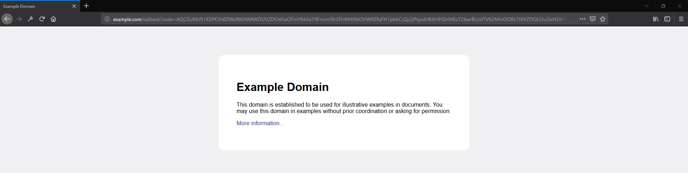

# RFID Jukebox

Control your spotify music using RFID cards and a RFID Scanner.

## Getting Started

These instructions will get you a copy of the project up and running on your local machine for development and testing purposes. See deployment for notes on how to deploy the project on a live system.

### Prerequisites

What things you need to install the software and how to install them

```
Python 3 (Made with: Python 3.7)
A Spotify premium account
Optional: RFID scanner and RFID cards
```

### Installing

Step 1: Creating a Spotify application
```
1. Go to https://developer.spotify.com/dashboard/

2. Login to your spotify account and click "Create a client id"

3. Name your application whatever you want and give it whatever description you want

4. When you are done you should see your client id and a button to get the client secret.
   
5. Go to edit settings and under redirect urls add "http://example.com/callback"
```
Step 2: Getting auth codes

```
1. Open up authorization.py in an IDE or text editor.

2. Paste your client id and client secret into the respective client_id and client_secret variables.

3. Run "python ./authorization.py" in a powershell or terminal window.

4. Follow the instructions on your screen.

5. When you click on the link, spotify will ask for permission to use your account with your spotify app.
   When you allow access, you will be returned to a website that looks like

```

```
6. Copy the URL after ?code= and paste it into the code variable inside authorization.py

7. Run "python ./authorization.py" in a powershell or terminal window again.


```

Step 3: Adding RFID's

```
1. Use the example spotifyData.json file to setup your RFID's with the proper commands.

2. If you want to add a playlist or album. 
   Go to the spotify client and get the spotify URI for the playlist or album you want.

3. It should look like
		"RFID": "spotifyURI"

```
Step 4: Running the program
```
1. In a terminal or powershell window run, "python ./main.py"

2. To run a command, scan an RFID card or type in the RFID you want.

3. to exit type "exit"

```


